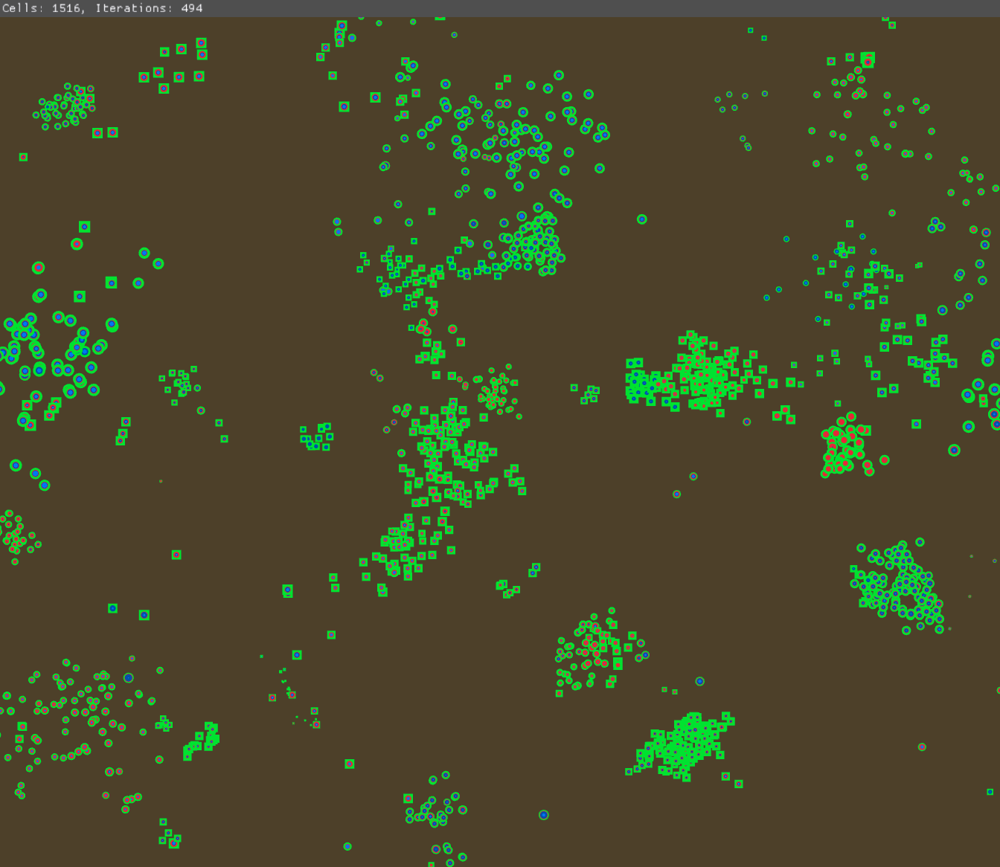

# life-simulation
Simulates evolution of bacteria

Cells are allowed to evolve through mutation and natural selection.
Cells have a genome consisting of 13 genes, giving them unique characteristics:

Green allows cells to collect energy from the sun, i.e. photosynthesis
Red allows them to attack and eat other cells
Dark blue allows them to defend from red cells
Light blue allows them to move around
A special trait, intelligence (denoted by a square), allows them to identify close cells that are weaker and move towards them instead of randomly.
All non-green traits cost energy

TODO: - Implement the biology of yeast cells. - Fix bug genome is None. - Multithreading for insane speed.